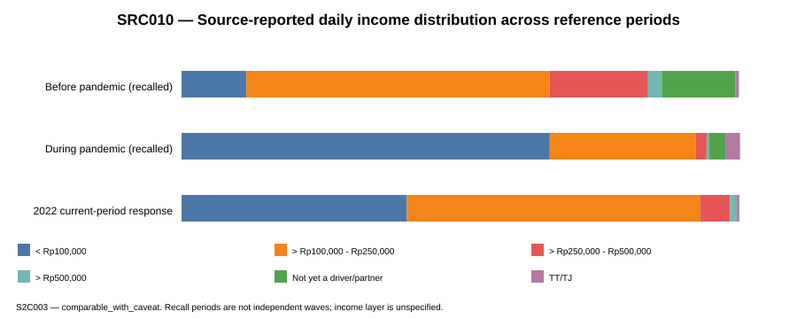
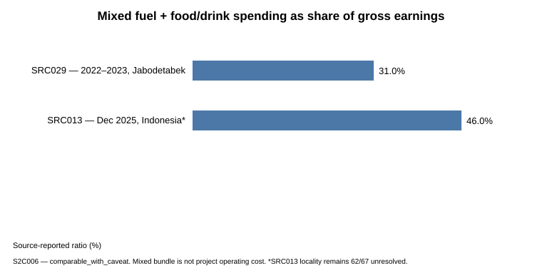
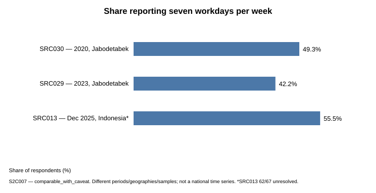
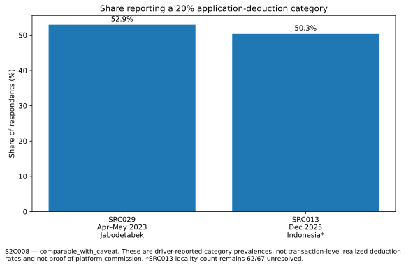

# The Real Cost of Being an Ojol Driver: What’s Left After a Day on the Road?

Evidence on earnings, deductions, costs, work intensity, purchasing-power pressure, and income adequacy among app-based motorcycle drivers in Indonesia.

## Bottom Line

**The evidence points to real economic pressure on ojol drivers: limited earnings, large cost burdens, long working hours, and weak income adequacy in the contexts that can be benchmarked.**

IDEAS reports mean gross daily earnings of **Rp168,000** in its 2023 Jabodetabek survey and **Rp126,000** in its 2025 multi-region survey. Using the source’s own cost boundary, monthly net income is reported at about **Rp2.9 million in 2023** and **Rp1.7 million in 2025**. These surveys are not a panel and should not be read as a precise national time series, but the source-level comparison points in one consistent direction: lower nominal earnings, higher daily spending, and a narrower amount left after costs.

The daily fuel + food/drink bundle rises from about **Rp53,000 per day (31% of gross earnings)** in the 2023 source to **Rp58,000 per day (46%)** in the 2025 source. That means gross daily earnings are about **25% lower** across the two source snapshots, the mixed daily spending bundle is about **9.4% higher**, its share of gross earnings is **15 percentage points higher**, and the source-defined monthly net estimate is about **41% lower**.

Those figures still do not capture every economic burden. The source itself notes that mobile/data costs and motorcycle maintenance further reduce income. In practice, maintenance includes periodic servicing, oil changes, tires and spare parts; drivers may also face parking or tolls where relevant. Food while working is a personal cash outflow, and accident, illness, vehicle breakdown, and downtime create additional cost or lost-income risk.

## Income Adequacy

A local 2023 IDEAS example makes the adequacy issue concrete. In Bekasi, source-reported gross monthly earnings of about **Rp3.9 million** were roughly **79% of the local minimum wage (UMK) of about Rp5.0 million**. After fuel, food/drink, and mobile costs under the source definition, reported monthly net income falls to about **Rp2.6 million**, or roughly **53% of UMK**, while average working time reaches **11.5 hours per day**.

UMK is not a universal living-wage measure for every driver, but it is a useful formal wage benchmark. In that context, the combination of below-benchmark income and substantially longer working hours indicates **weak income adequacy**.

Purchasing-power context reinforces the pressure. Bank Indonesia reports CPI inflation of **2.61% in 2023, 1.57% in 2024, and 2.92% in 2025**. The 2025 snapshot therefore shows lower nominal earnings in an environment where the general price level was still rising rather than falling.

## Key Findings

- **Gross earnings are limited and appear lower in the later source snapshot.** IDEAS reports Rp168,000/day in 2023 versus Rp126,000/day in 2025.
- **The cost burden is large and takes a larger share of gross earnings.** Fuel + food/drink equals about 31% of gross in the 2023 source and 46% in the 2025 source.
- **Source-defined net income is substantially lower in the 2025 snapshot.** About Rp2.9 million/month in 2023 versus Rp1.7 million/month in 2025 under the source definition.
- **Application deductions are a material reported pressure.** A 20% deduction category is reported by 52.9% of respondents in IDEAS 2023 and 50.3% in IDEAS 2025; 24.2% of 2025 respondents report 25–30%. These are respondent-reported categories, not audited transaction-level realized rates.
- **Work intensity is high.** IDEAS 2023 source means are about 11 working hours, 10 completed orders, and 42 km per day. In the 2025 source, 51.0% report 9–12 working hours/day and 55.5% report seven workdays/week.
- **Income adequacy is weak where a local wage benchmark is available.** In Bekasi 2023, the source-defined post-cost estimate is about 53% of UMK despite average working time of 11.5 hours/day.
- **Additional costs and work risks further compress the amount left for drivers.** Mobile/data, servicing, oil changes, tires/spare parts, and work disruption from accidents, illness, breakdown, or downtime are economically relevant even when not all are observed on one matched basis.

## Gross Unit Economics

For aligned IDEAS 2023 Jabodetabek observations (n=186), the project derives two transparent gross rates from source means:

- **Rp15,272.73 gross per source-reported working hour**
- **Rp16,800 gross per completed order**

These are gross productivity measures, not take-home pay.

## Research Questions — Final Synthesis

| Question | Final answer |
|---|---|
| What earnings are visible in the main sources? | IDEAS reports Rp168k gross/day and about Rp2.9m source-defined net/month in 2023; Rp126k gross/day and about Rp1.7m source-defined net/month in 2025. |
| How large is the daily cost pressure? | Fuel + food/drink equals about Rp53k/day (31% of gross) in 2023 and Rp58k/day (46%) in 2025; mobile/data and maintenance reduce income further. |
| Does the income appear adequate? | **Weak in the available benchmark context.** Bekasi 2023 source-defined net is about 53% of UMK with 11.5 hours of work per day. |
| What do the 2023 and 2025 source snapshots indicate? | **Economic pressure worsens directionally:** lower gross earnings, higher mixed daily spending, a larger cost share, and lower source-defined net income. |
| How important are application deductions? | **Material in respondent reports:** about half report a 20% category in both IDEAS sources, with 24.2% reporting 25–30% in 2025. |
| How heavy is the workload? | **High:** long working days, frequent seven-day workweeks, meaningful order counts, and substantial daily distance. |
| Overall conclusion? | **Driver economics are under pressure, and the income left after costs is often weak relative to workload and the formal wage benchmark available in the evidence.** |

## Interpretation Boundaries

The conclusion above does not mean every ojol driver in Indonesia earns the same amount. The main surveys differ in period, geography, sample design, and measurement definition. The project therefore keeps the following distinctions explicit:

- source-defined net income is retained as a source-defined measure and is not relabelled as project net operating earnings;
- respondent-reported deduction categories are not treated as audited transaction-level realized commission rates;
- the 2023 and 2025 IDEAS surveys are snapshots from different samples, not an individual panel or a precise national trend;
- UMK is used only as a formal local wage benchmark, not as a universal living-wage estimate;
- missing cost items are not silently imputed or assigned zero.

These boundaries limit the precision and generalizability of the conclusion, but they do not erase the substantive pattern visible in the evidence.

## Regulatory Context

Legal rules, official implementation statements, platform-stated policies, driver-reported deductions, and realized transaction deductions are treated as separate evidence layers.

The project does **not** interpret the 2023/2025 reported 20% deduction categories and a stated or planned 8% policy in 2026 as a measured decline in realized commission. They differ in period, service, platform, calculation base, and evidence layer.

See the [regulatory reconciliation record](metadata/stage6_regulatory_reconciliation.csv) for the detailed evidence boundary.

## Visual Results

### Source-defined daily-income distribution



### Mixed fuel plus food/drink spending



### Seven-day workweek prevalence



### Reported 20% deduction-category prevalence



## Repository Structure

```text
data/
  analytical/        validated analytical result tables
  processed/         cleaned analytical inputs
  standardized/      harmonized source observations
  raw/               redistributable source material where permitted

docs/                research design and supporting documentation
metadata/            source, methodology, comparability, validation, and traceability records
notebooks/            analytical notebooks
visualizations/       validated figures used in the analysis
```

Key public artifacts include:

- [Research design](docs/stage0_research_design.md)
- [Source registry](metadata/stage1_source_registry.csv)
- [Gross unit-economics results](data/analytical/stage4_unit_economics_results.csv)
- [Evidence-linked findings](data/analytical/stage5_findings.csv)
- [Research-question synthesis](data/analytical/stage6_research_question_synthesis.csv)
- [Regulatory reconciliation](metadata/stage6_regulatory_reconciliation.csv)
- [Evidence-gap register](metadata/stage6_evidence_gap_register.csv)
- [Methodological decision log](metadata/stage6_methodological_decision_log.csv)
- [Synthesis validation](metadata/stage6_synthesis_validation.csv)

## Reproducibility and Traceability

The repository preserves source URLs, publishers, observation periods, geography, sample/population details, measurement definitions, comparability status, uncertainty, and value provenance where available.

Analytical values remain classified as `observed`, `source_reported`, `derived`, `modelled`, or `scenario`. Missing values are not silently replaced with assumptions.

## Final Verdict

**The main conclusion is not that the economics are unknowable. The evidence shows that ojol drivers in the analyzed survey contexts face a substantial economic squeeze.**

Gross earnings are limited, daily cost burdens absorb a large and rising share of gross income, reported deductions are material, and long working hours are common. Where a local wage benchmark is available, post-cost income is far below the formal minimum-wage benchmark despite longer-than-standard working time. Positive inflation further weakens purchasing-power conditions around the later snapshot.

The exact national daily take-home amount cannot be reduced to one universal number from the current evidence, but the direction of the economic conclusion is clear: **the income left to drivers is under pressure and is often weak relative to the costs, time, and work risks they carry.**
